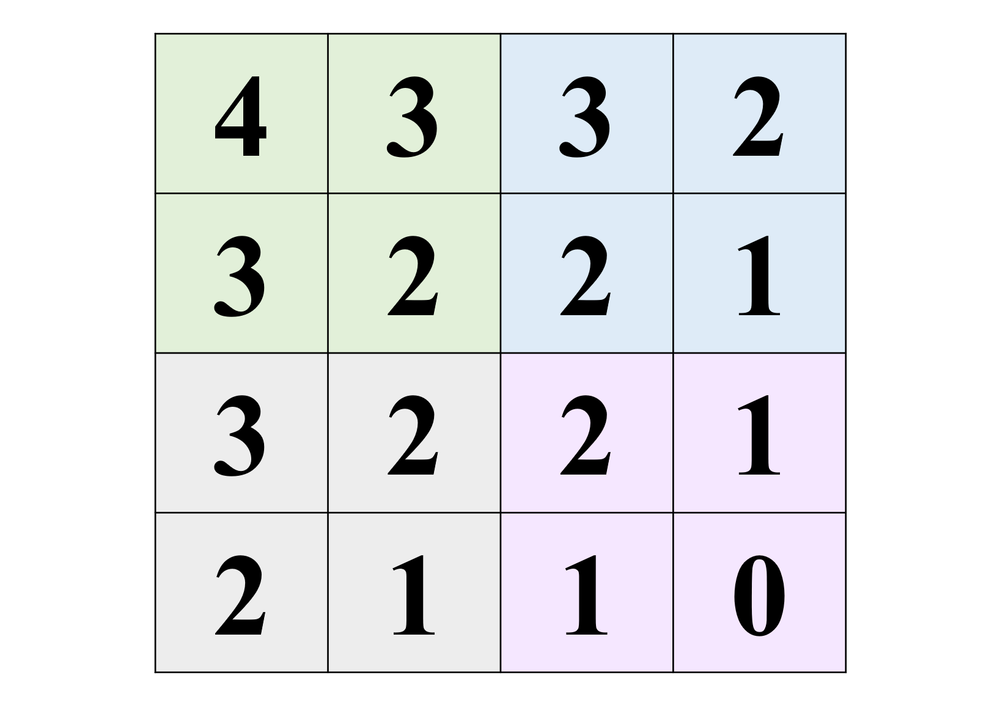
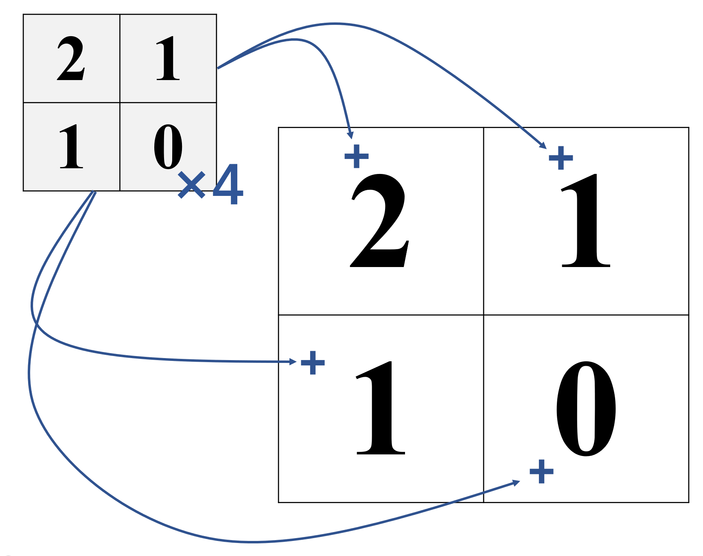

在总结某一类遗传题的时候，我发现它和卷积竟然有着很深的关系。

<!-- more -->

## 题目

我所说的「题目」，就是那种经典的叠加效应的题——多对等位基因自由组合，其中显性基因的个数（基因型中大写字母的个数）决定性状（高度/长度等）。



**不一定正确的例题**

某植物茎的高度由两对等位基因（A，B）控制且遵循自由组合定律。两对等位基因决定茎高度时，显性基因越多其茎高度越高。现已知基因型为AABB的个体茎高度为48cm，基因型为Aabb个体为30cm。则将基因型为AaBb的个体自交，后代中高度为
42cm的个体的比例为？

*（我认为的）答案：$\frac{1}{4}$*



这个题目本来很简单——自己画一个经典的4×4基因棋盘然后数一数大写字母的个数就行了。但是在~~仔细~~分析这张表之后，发现了一些有趣的东西。

## 大写个数与杨辉三角

为了方便，让我们还是画一个4×4棋盘，并标注一下每一格的大写字母数量，这张表很重要，接下来叫它**表1**：

|  配子  |     **AB**     |     **aB**     |     **Ab**      |    **ab**     |
| :----: | :------------: | :------------: | :-------------: | :-----------: |
| **AB** | AABB   `4`  | AaBB   `3`  |  AABb   `3`  | AaBb   `2` |
| **aB** | AaBB   `3`  | aaBB    `2` | AaBb     `2` | aaBb   `1` |
| **Ab** | AABb   `3`  | AaBb    `2` | AAbb     `2` | Aabb   `1` |
| **ab** | AaBb    `2` | aaBb   `1`  |  Aabb   `1`  | aabb   `0` |

接下来统计一下表1中各个数字出现的次数：

| 大写字母数量 | 表1中出现的次数 |
| :----------: | :-------------: |
|     `4`      |        1        |
|     `3`      |        4        |
|     `2`      |        6        |
|     `1`      |        4        |
|     `0`      |        1        |

那么让我们仔细来分析一下`1, 4, 6, 4, 1`这个数列。不妨给他起个名字吧。

$$t_2[n]=[1,4,6,4,1]$$

- 这个数列一定是回文（对称）的。
  这是因为，在我们的统计中大写字母和小写字母的地位相等。如果统计小写字母，理论上会得到与统计大写字母相反的结果；又因为地位相等所以会得到和大写字母相同的结果，所以大写字母的统计结果必然是回文的。

- **它是杨辉三角的第4行（从第0行开始）。**

除此之外，不仅是两对等位基因，其他数量对等位基因的这个结果也会出现在杨辉三角中。

1. 一对等位基因（Aa 自交）：
  $$t_1[n]=[1,2,1]$$

2. 三对等位基因（AaBbCc 自交）：
  $$t_3[n]=[1,6,15,20,15,6,1]$$

### 杨辉三角

既然和[杨辉三角](https://zh.wikipedia.org/wiki/%E6%9D%A8%E8%BE%89%E4%B8%89%E8%A7%92%E5%BD%A2)扯上了关系，那不得不简单看一眼杨辉三角了。

$$
\begin{array}{c}
1\\
1\quad 1\\
\color{blue}{1\quad 2\quad 1}\\
1\quad 3\quad 3\quad 1\\
\color{blue}{1\quad 4\quad 6\quad 4\quad 1}\\
1\quad 5\quad 10\quad 10\quad 5\quad 1\\
\color{blue}{1\quad 6\quad 15\quad 20\quad 15\quad 6\quad 1}\\
1\quad 7\quad 21\quad 35\quad 35\quad 21\quad 7\quad 1\\
\end{array}
\nonumber
$$


刚刚提到，在本文中，我们在谈论杨辉三角的行数时，总是从0开始数。也就是，`1`是第0行，`1 3 3 1`是第3行，以此类推。由于杨辉三角的性质，这样定义的行数恰好是该行的第二项（除了开头`1`以外的一项），比如，第**4**行`1 *4* 6 4 1`的第二项为**4**。


## 深入分析……

首先，让我们看看一个基础而熟悉的表——Aa自交后代的基因棋盘。按照惯例还是写出每个基因型的大写字母个数。这个表叫做**表2**：

| 配子  |   **A**    |    **a**    |
| :---: | :---------: | :---------: |
| **A** | AA   `2` | Aa   `1` |
| **a** | Aa   `1` | aa   `0` |

这个表是如此的简单，以至于无需统计——仅凭肉眼即可看出`1, 2, 1`的数列。

有趣的是，如果我们将表2和表1放在一起对比，则会发现一些有趣的事情。

首先，让我们把表1涂上颜色。

让我们分析一下这张图。

- 看整体。
  - 整个表被分成了四份（不同颜色），注意到和的内容一样。整体布局类似表2。
  - 从开始，每个数字`+1`得到和色块，`+2`则得到色块。四个色块对应数字差值与表二`2-{1,1}-0`类似。

- 看局部。
  - 与表2一致。
  - 每一个色块内，左下角的数字和右上角的数字相同。并且每一个色块内的差值也类似表二的`2-{1,1}-0`。

既然整体上和局部上都类似表2，那么显然，我们可以认为，这个表1是表2「嵌套」得来的。具体来讲，就是4个小表2分别嵌入到一个大表2的各个格子中，嵌入时小表2的每个数字加上被嵌入的大表2格子中的数字。

既然表1可以看做是表2此般嵌套后形成的，那表1 `1, 4, 6, 4, 1`的数列也应该可以看做表2的 `1, 2, 1`和自身经过某种操作之后形成的。那么究竟是什么操作呢？答案是「**卷积**」，具体一点，是「离散的」卷积。

## 卷积

关于卷积，[YouTuber](https://www.youtube.com/@3blue1brown)、[UP主](https://space.bilibili.com/88461692/) 3Blue1Brown发过一个视频，可以看看：

Bilibili视频

<iframe style="position: absolute; width: 100%; height: 100%; left: 0; top: 0;" src="https://player.bilibili.com/player.html?aid=391585555&bvid=BV1Vd4y1e7pj&cid=931763043&page=1" frameborder="no" scrolling="no"></iframe>

YouTube视频

<iframe width="560" height="315" src="https://www.youtube.com/embed/KuXjwB4LzSA" title="YouTube video player" frameborder="0" allow="accelerometer; autoplay; clipboard-write; encrypted-media; gyroscope; picture-in-picture; web-share" allowfullscreen></iframe>

 

由于我也讲不清楚，所以在这里我索性也不介绍卷积了。

我们这次只需要了解离散的卷积，而这一点在视频中已经有了体现。所以让我们直接开始尝试吧。

$$t_1[n]=[1,2,1]$$

与它自己进行离散卷积之后

$$\left(t_1 \ast t_1\right)[n]=[1,4,6,4,1]=t_2$$

看来我们已经得出了结论。遗传（似乎已经没啥关系了）确实和卷积有关。

## 深入挖掘……

让我们重新看一眼杨辉三角。

$$
\begin{array}{c}
1\\
1\quad 1\\
1\quad 2\quad 1\\
1\quad 3\quad 3\quad 1\\
1\quad 4\quad 6\quad 4\quad 1\\
1\quad 5\quad 10\quad 10\quad 5\quad 1\\
1\quad 6\quad 15\quad 20\quad 15\quad 6\quad 1\\
1\quad 7\quad 21\quad 35\quad 35\quad 21\quad 7\quad 1\\
\end{array}
\nonumber
$$

### Unfinished

